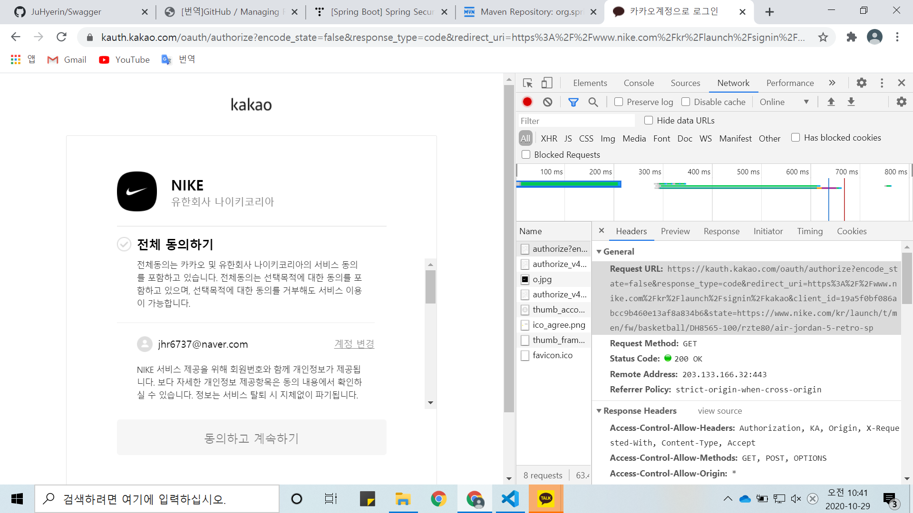

# SpringSecurity 용어

* 접근 주체\(Principal\) : 보안 시스템이 작동되고 있는 애플리케이션에 접근하는 유저
* 인증\(Authenticate\) : 현재 유저가 누구인지 확인\(ex. 로그인\) -&gt;본인이 맞는지 확
  * 애플리케이션의 작업을 수행할 수 있는 주체임을 증명
  * 애플리케이션에 접근할 수 있는지 검사
* 인가\(Authorize\) : 현재 인증 유저가 어떤 서비스, 페이지에 접근할 수 있는 권한이 있는지 검사
* 권한 : 인증된 주체가 애플리케이션의 동작을 수행할 수 있도록 허락되있는지를 결
  * 권한 승인이 필요한 부분으로 접근하려면 인증 과정을 통해 주체가 증명 되어야만 한다
  * 권한 부여에도 두가지 영역이 존재하는데 웹 요청 권한, 메소드 호출 및 도메인 인스턴스에 대한 접근 권한 부여

Spring Security는 Spring 기반의 애플리케이션의 보안\(인증과 권한, 인가 등\)을 담당하는 Spring 하위 프레임워크입니다  
Spring Security는 "인증" 과 "권한" 에 대한 부분을 Filter의 흐름에 따라 처리합니다  

